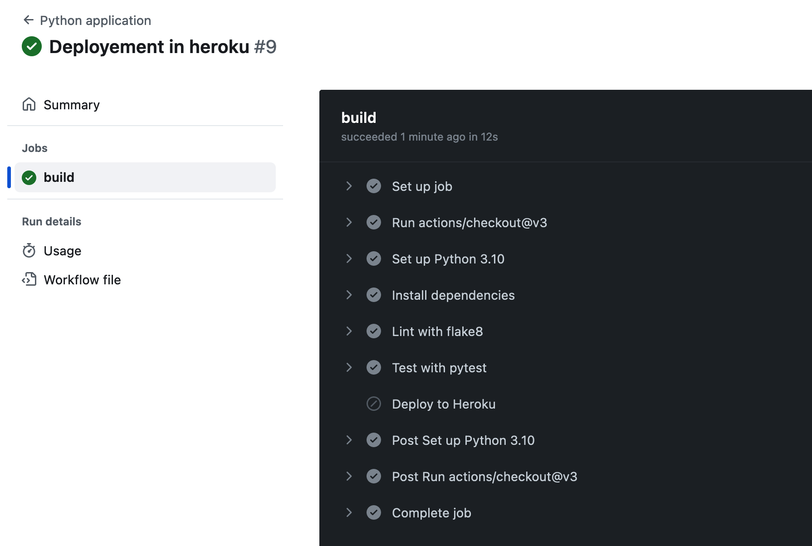

# DataPipeline
Create you own data pipeline using github actions . You start by extracting the data from a source (e.g., CSV, API, database). Then, you transform the data (e.g., data cleaning, normalization). Finally, you load the data into a target destination (e.g., database, data warehouse).

GitHub Actions help you automate your software development workflows in the same place you store code and collaborate on pull requests and issues. You can write individual tasks, called actions, and combine them to create a custom workflow. Workflows are custom automated processes that you can set up in your repository to build, test, package, release, or deploy any code project on GitHub.

With GitHub Actions you can build end-to-end continuous integration (CI) and continuous deployment (CD) capabilities directly in your repository.

It might not be helpful for your personal project but, it will be very helpful in a organization having multipe layers.

Deploying Python Application on Heroku

    Install Heroku CLI or uding command (`brew tap heroku/brew && brew install heroku`)
    Verify if its installed using command (`heroku`)
    Login to Heroku CLI session: heroku login
    Create new Heroku App: heroku create
    (I don't want to give my personal unm/pwd everytime any change occues to authnticate and deploy. so i am using an API to do authentication)
    Generate Authentication Token: `heroku authorizations:create`
    'Deploy to Heroku' Action:

This is how it will look like :

For more reading https://github.blog/2022-02-02-build-ci-cd-pipeline-github-actions-four-steps/
